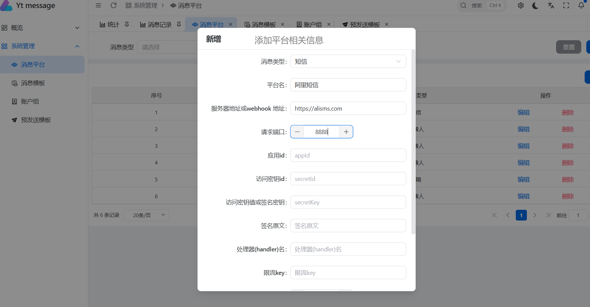
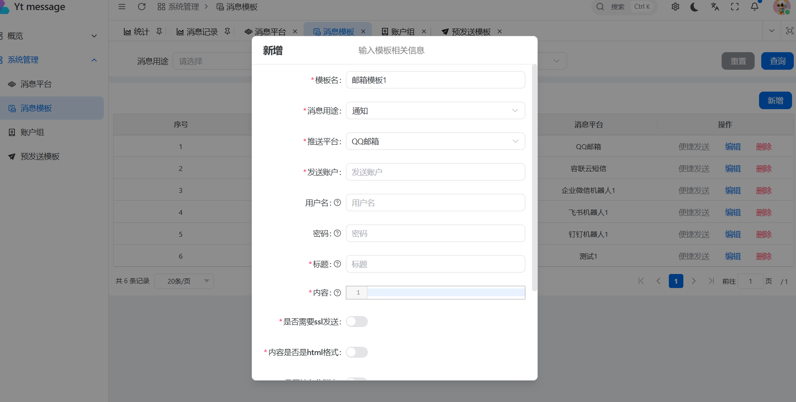
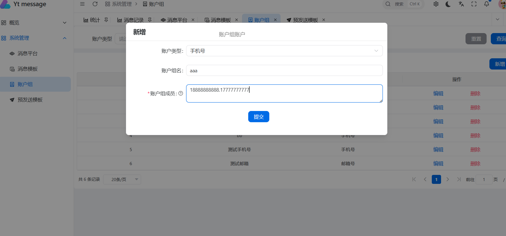
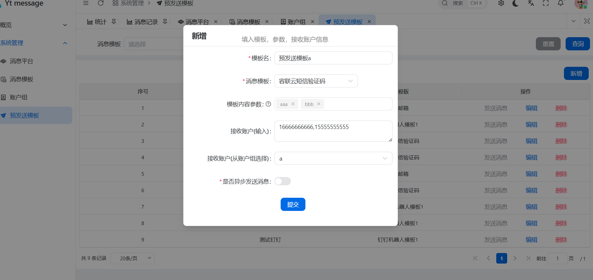
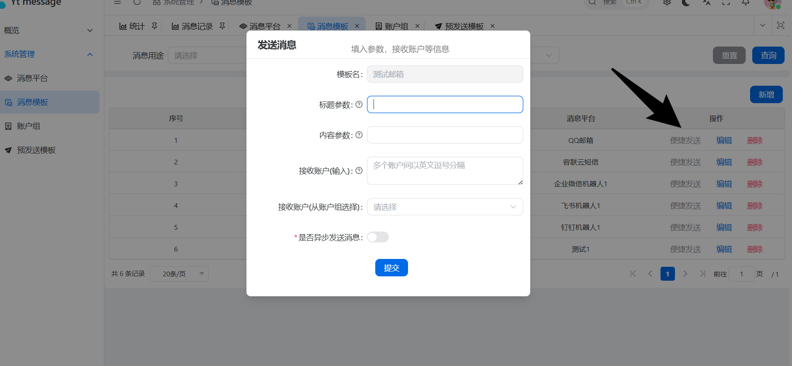
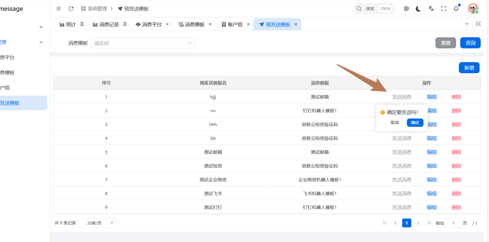
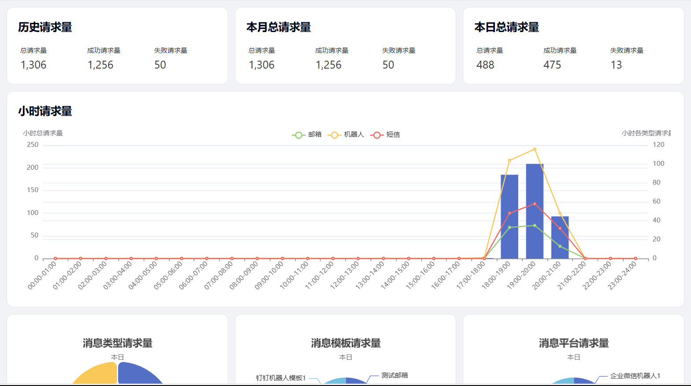
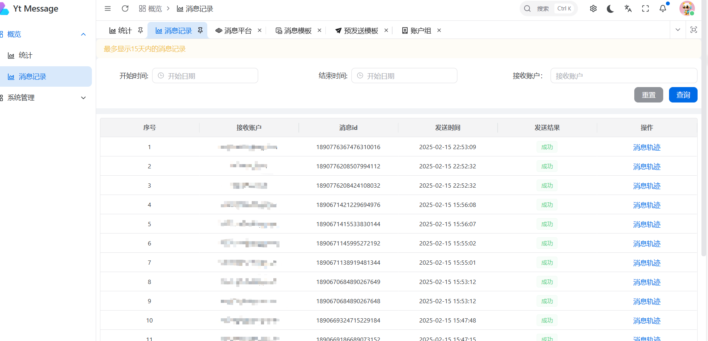
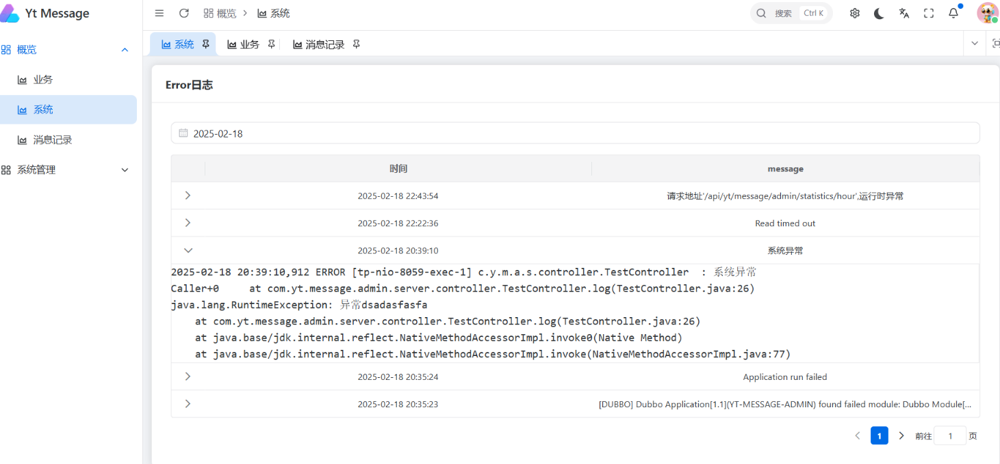

# yt-message

<p align="center">
	
</p>
<p align="center">
	
	
	
    
    
    
    
    
    
    
    
	
    
    
</p>

## 简介

yt-message是一个消息推送平台，提供各种类型消息推送功能，目前支持短信，邮箱，企业微信、飞书、钉钉机器人消息，并且支持自定义消息处理，未来将接入更多类型消息推送。

## 主要功能

- 消息平台：对接各种第三方平台，例如阿里，腾讯等等
- 消息模板：定义消息模板，包括消息内容，内容参数，接收账户，消息平台等等
- 账户组：预先定义消息接收的账户
- 预发送模板：提前设定消息模板和接收账户，一键发送
- 实时报表：使用flink实时处理记录发送的消息，并输出统计数据，使用echarts根据统计数据生成实时报表
- 消息记录：使用日志管理框架Graylog记录业务数据和应用日志，通过调用Graylog提供的Api检索日志，生成消息记录和消息轨迹，使用Graylog的的警告功能对error级别日志实现预警功能
- RPC接口：通过Dubbo提供RPC接口与其他项目集成
- 小功能：消息发送限流，消息重复处理等等
- ......

## 目录结构

```
YT-MESSAGE
├─yt-message-admin              管理端
├─yt-message-admin-ui           管理端前端
├─yt-message-api                向外提供RPC
├─yt-message-common             通用
├─yt-message-handler            消息处理端
├─yt-message-log                日志配置  
├─yt-message-mq                 消息队列篇配置
└─yt-message-stream-flink       流处理端
```

## 功能演示

### 1.创建三方平台



### 2.创建消息模板



### 3.创建账户组



### 4.创建预发送消息模板



### 5.发送消息

**消息主要构成：（消息模板+消息内容参数+接收账户）或者 预发送消息模板**

#### 1.  消息模板发送

#### 2. 预发送消息模板发送




#### 3. RPC调用

例

引入api包

```
<dependency>
    <groupId>com.yt</groupId>
    <artifactId>yt-message-api</artifactId>
    <version>version</version>
</dependency>
```


```
	@DubboReference()
    private MessageService messageService;

    @Test
    void testSendMessage() {
         SendMessageRequest build = SendMessageRequest.sendEmailMessageRequestBuilder()
                    .templateId(333L)
                    .contentParams(new String[]{"1","22","aa"})
                    .subjectParams(new String[]{"3","bb","aa"})
                    .receiveAccount("702279350@qq.com")
                    .build();
            MessageSendRsp messageSendRsp = messageService.sendMessage(build);
       }
   }
```

### 6.统计图表



### 7.消息记录



### 8.error日志监控



## 项目部署

待更新

## 后续更新

- [ ] 支持更多的消息类型 ，安卓通知栏、微信服务号、微信小程序、支付宝小程序等待

- [ ] 引入用户管理

- [ ] 延时消息

- [x] 运行时error日志页面

- [ ] ......

  

## 另外

求工作机会！！！